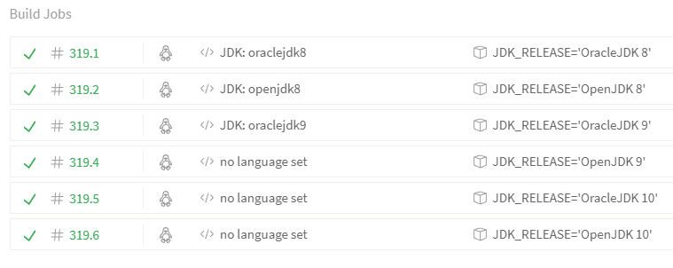

# JDK Matrix on Travis CI



## Configuration

The Travis CI configuration uses [install-jdk.sh](2017-12-08-install-jdk-on-travis.md) shell script.

`.travis.yml`

```yml
sudo: false
dist: trusty
language: java

matrix:
  include:
# 8
    - env: JDK_RELEASE='OracleJDK 8'
      jdk: oraclejdk8
    - env: JDK_RELEASE='OpenJDK 8'
      jdk: openjdk8
# 9
    - env: JDK_RELEASE='OracleJDK 9'
      jdk: oraclejdk9
    - env: JDK_RELEASE='OpenJDK 9'
      install: . ./install-jdk.sh -F 9
# 10-ea
    - env: JDK_RELEASE='OracleJDK 10'
      install: . ./install-jdk.sh -F 10 -L BCL
    - env: JDK_RELEASE='OpenJDK 10'
      install: . ./install-jdk.sh -F 10 -L GPL

script:
- java -version
```
