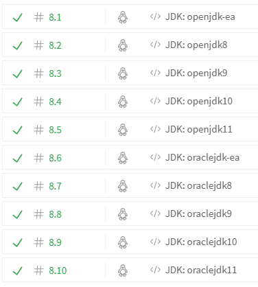

# JDK Matrix on Travis CI

`bach/install-jdk.sh` now supports JDK releases ranging from version 9 up to 11.

Travis CI considers to [Switch to `bach` for installing and managing JDKs](https://github.com/travis-ci/travis-cookbooks/issues/976)

[](https://staging.travis-ci.org/sormuras/sormuras.github.io/builds/716080)


## Configuration

Only works on https://staging.travis-ci.org

`.travis.yml`

```yml
sudo: false
dist: trusty
language: java

matrix:
  include:
    - jdk: openjdk-ea
    - jdk: openjdk8
    - jdk: openjdk9
    - jdk: openjdk10
    - jdk: openjdk11
    - jdk: oraclejdk-ea
    - jdk: oraclejdk8
    - jdk: oraclejdk9
    - jdk: oraclejdk10
    - jdk: oraclejdk11

script:
  - echo PATH = ${PATH}
  - echo JAVA_HOME = ${JAVA_HOME}
  - java -version
```
