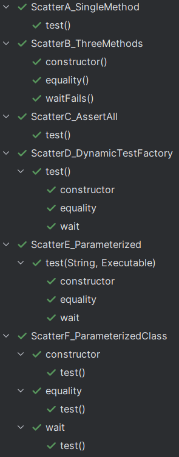

# Scatter Assertions

Find source at [demo/test/scatter](demo/test/scatter)



## 1. Single method with three assertions

Sequential assertions in a single method.

```java
@Test
void test() {
  var object = new Object();
  assertNotNull(object);
  assertNotEquals(new Object(), object);
  assertThrows(IllegalMonitorStateException.class, object::wait);
}
```

## 2. Three methods with single assertion each

Each assertion resides in its own test method.

```java
private final Object object = new Object();

@Test
void constructor() {
  assertNotNull(object);
}

@Test
void equality() {
  assertNotEquals(new Object(), object);
}

@Test
void waitWithoutMonitorFails() {
  assertThrows(IllegalMonitorStateException.class, object::wait);
}
```

## 3. Single method with grouped assertion

In a grouped assertion all assertions are executed, and any failures will be reported together.

```java
@Test
void test() {
  var object = new Object();
  assertAll(
      () -> assertNotNull(object),
      () -> assertNotEquals(new Object(), object),
      () -> assertThrows(IllegalMonitorStateException.class, object::wait));
}
```

<https://junit.org/junit5/docs/current/user-guide/#writing-tests-assertions>

## 4. Single test factory method with three dynamic tests

A `DynamicTest` is a test case generated at runtime. It is composed of a display name and an `Executable`.
`Executable` is a functional interface which means that the implementations of dynamic tests can be
provided as lambda expressions or method references.

```java
@TestFactory
Stream<DynamicTest> test() {
  var object = new Object();
  return Stream.of(
      dynamicTest("constructor", () -> assertNotNull(object)),
      dynamicTest("equality", () -> assertNotEquals(new Object(), object)),
      dynamicTest("waitWithoutMonitorFails", () -> assertThrows(Exception.class, object::wait)));
}
```

<https://junit.org/junit5/docs/current/user-guide/#writing-tests-dynamic-tests>

## 5. Single parameterized method

```java
@ParameterizedTest
@MethodSource
void test(String caption, Executable executable) {
  assertDoesNotThrow(executable, caption);
}

static Stream<Arguments> test() {
  var object = new Object();
  return Stream.of(
      Arguments.of("constructor", (Executable) () -> assertNotNull(object)),
      Arguments.of("equality", (Executable) () -> assertNotEquals(new Object(), object)),
      Arguments.of("waitWithoutMonitorFails", (Executable) () -> assertThrows(Exception.class, object::wait)));
}
```

<https://junit.org/junit5/docs/current/user-guide/#writing-tests-parameterized-tests>
