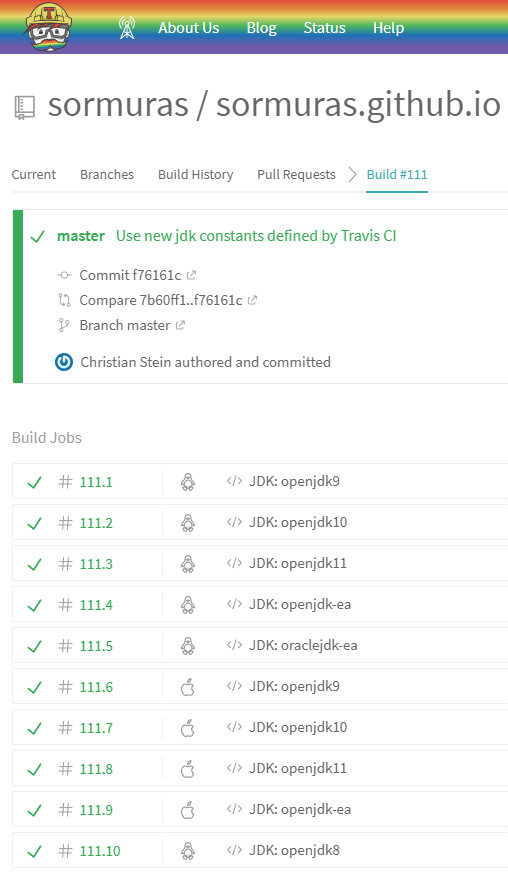

# JDK Matrix on Travis CI

✨ Travis CI just integrated [`bach/install-jdk.sh`](https://github.com/sormuras/bach#install-jdksh) by default! ✨

You may now replace your manual setup with official `jdk` constants offered by Travis CI.
New `jdk` options for using [OpenJDK builds](http://jdk.java.net/) are:
- `openjdk9`
- `openjdk10`
- `openjdk11`
- `openjdk-ea` (get _latest and greatest_ early access build)

Oracle JDK builds are supported, too: replace `open` with `oracle` in the constant name.

## Screenshot or it didn't happen!

[Build #111](https://travis-ci.org/sormuras/sormuras.github.io/builds/386025224)




## Configuration

`.travis.yml`

```yml
language: java

sudo: false
dist: trusty

os:
- linux
- osx

jdk:
- openjdk9
- openjdk10
- openjdk11
- openjdk-ea
- oraclejdk-ea

matrix:
  include:
  - os: linux
    jdk: openjdk8
  allow_failures:
  - os: osx
    jdk: oraclejdk-ea # TODO Download, install and use "dmg" on Travis CI

before_install:
- unset _JAVA_OPTIONS

install:
- echo "The default Travis install script is being skipped!"

before_script:
- echo JAVA_HOME = ${JAVA_HOME}
- echo PATH = ${PATH}

script:
- java -version

after_script:
- ls ${JAVA_HOME}
- cat "${JAVA_HOME}/release"

```
