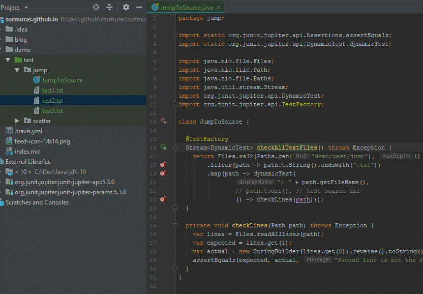

# JUnit 5.3 Dynamic Tests with URI `TestSource`

Supplying a test source URI to a dynamic test enables IDEs to jump right to the underlying file the dynamic test was created for
(And not to the TestFactory-annotated method as before.



`JumpToSource.java`

```java
// pending...
```
