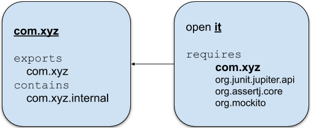
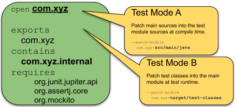

# Testing In The Modular World

This is a blog about how to organize, find and execute tests.
This is **not** [an introduction to the Java module system](https://blog.codefx.org/java/java-module-system-tutorial/).

_tl;dr fork/clone and run sample project [sormuras/testing-in-the-modular-world](https://github.com/sormuras/testing-in-the-modular-world) using Maven as its build tool._

## Good ol' times

Flash-back to the early days of unit testing in Java and to the question: [_"Where should I put my test files?"_](https://junit.org/junit4/faq.html#organize_1)

- You can place your tests in the same package and directory as the classes under test.

For example:

```text
src/
   com/
      xyz/
         📜 SomeClass.java
         🔨 SomeClassTests.java
```

While adequate for small projects, many developers felt that this approach clutters the source directory, and makes it hard to package up client binaries without also including unwanted test code, or writing unnecessarily complex packaging tasks.

- An arguably better way is to place the tests in a separate parallel directory structure with package alignment.

```text
main/                          test/
   com/                           com/
      xyz/                           xyz/
         📜 SomeClass.java              🔨 SomeClassTests.java
```

This approach allows test code to access all the `public` and package visible members of the classes under test.

Who made it and still makes it work today? The **`class-path`**!
Every class-path element points to a root of assets contributing to the resources available at runtime.
A special type of resource is a Java class which in turn declares a package it belongs to.
There is no enforced restriction of how many times a package may be declared on the class-path.
All assets are merged logically at runtime, effectively resulting in the same situation where classes under test and test classes reside physically in the same directory.
Packages are treated as open name spaces: test code may access main types as if they were placed in the same package and directory.
This includes types with using *package private* and `protected` modifiers.

Ever placed a test class in a different package compared to the class under test?

```text
main/                          test/                               test/
   com/                           com/                                it/
      xyz/                           xyz/                                💚 PackageComXyzApiTests.java
         📜 SomeClass.java              🔨 SomeClassTests.java
```

Welcome back to "extra-modular testing in the package world"!

Which types and members from main are accessible from such an external test?
The answer is left open for a brush-up of the reader's access modifier visibility memory.
_Hint: an accessibility table is presented later in this blog._

## Fast-forward to modules

Packages are now members of modules and only some packages are exported to other modules for consumption.
Extrapolating the idea of separated source set roots to the Java module system could lead to a layout like:

```text
main/                          test/                               test/
   com.xyz/                       com.xyz/                            it/
      ☕ module-info.java             🔥 module-info.[java|test]        💚 module-info.java
      com/                           com/                                it/
         xyz/                           xyz/                                💚 ModuleComXyzApiTests.java
            📜 SomeClass.java              🔨 SomeClassTests.java
            internal/                      internal/
               📜 OtherClass.java             🔨 OtherClassTests.java
```

You already noticed that the source set in the middle contains a cloak-and-dagger `module-info.[java|test]` file.
Before diving into this topic, let's examine the other two plain and simple module descriptors.

### ☕ `module com.xyz`

- The main module descriptor for `com.xyz` contains some imaginary entries.
- It only exports package `com.xyz` but also contains the `com.xyz.internal` package.

```java
module com.xyz {
    requires java.logging;
    requires java.sql;

    exports com.xyz;
}
```
> _Note!_ A module named `com.xyz` should only contain packages whose names start with `com.xyz` as well.
Why?
See [Stephen's JPMS module naming](https://blog.joda.org/2017/04/java-se-9-jpms-module-naming.html) blog for details.

### 💚 `open module it`

- The test module `it` reads module `com.xyz` and a bunch of testing framework modules.
- It may only refer to accessible (`public` and residing in an `exported` package) types in those other modules.
- This includes module `com.xyz` in particular: tests may refer to public types in package `com.xyz` - test can't refer to types in non-exported package `com.xyz.internal`.
- Module `it` is declaring itself `open` allowing test discovery via deep reflection.

```java
open module it {
    requires com.xyz;

    requires org.junit.jupiter.api;
    requires org.assertj.core;
    requires org.mockito;
}
```

#### Extra-Modular Testing Diagram

Extra-modular testing is the easy part.



Test module `it` is main module `com.xyz`'s first customer.
It adheres to the modular boundaries in the same way as any other module does.
The only visible package is `com.xyz`, package `com.xyz.internal` is concealed.
Same goes for the modules of the external testing frameworks like JUnit, AssertJ, Mockito and others.
Only their published API is use-able by test classes contained in module `it`.

Take a 2-minute-break and watch Sander Mak describing modular testing in his [Java Modularity: the Year After](https://vimeo.com/289846017#t=2562s) talk.
He repeats the just introduced extra-modular testing and gives a brief outlook to in-module testing.

Now to the not so easy part...

## In-module Testing

Let's start the in-module testing section with an enhanced [accessibility](https://docs.oracle.com/javase/tutorial/java/javaOO/accesscontrol.html) table that includes columns for being in a different module.

### Accessibility

The `public class A` in `package foo` with one field for every access level modifier serves as a reference.
Each column lists another type and shows how access levels affect visibility.
An ✅ indicates that this member of `A` is accessible, else ❌ is shown.

- **B** - same module, same package, **other** compilation unit: `package foo; class B {}`
- **C** - same module, **other** package, subclass: `package bar; class C extends foo.A {}`
- **D** - same module, **other** package, unrelated: `package bar; class D {}`
- **E** - **other** module, package `foo` is exported: `package bar; class E {}`
- **F** - **other** module, package `foo` _not_ exported `package bar; class F {}`

| **A**                          |**B** |**C** |**D** |**E** |**F** | Access Level Modifier              |
|:-------------------------------|:----:|:----:|:----:|:----:|:----:|:-----------------------------------|
| `package foo;`                 |      |      |      |      |      |                                    |
| `public class A {`             |  ✅  |  ✅  |  ✅ |  ✅  | ❌  | `public`                           |
| &nbsp;&nbsp;`public int i;`    |  ✅  |  ✅  |  ✅ |  ✅  | ❌  | `public`                           |
| &nbsp;&nbsp;`protected int j;` |  ✅  |  ✅  |  ❌ |  ❌  | ❌  | `protected`                        |
| &nbsp;&nbsp;`int k;`           |  ✅  |  ❌  |  ❌ |  ❌  | ❌  | no modifier or _package private_   |
| &nbsp;&nbsp;`private int l;`   |  ❌  |  ❌  |  ❌ |  ❌  | ❌  | `private`                          |
| `}`                            |      |      |      |      |      |                                    |

Column **E** and **F** are already covered by modular extra-modular testing as shown above in the `open module it` section.
With **F** just confirming that a _not_ exported package is _not_ accessible from another module.
But we want to write unit tests like we always did before and access internal components. We want **B**, **C** and **D** back!
Now you may either drop the entire Java module system (for testing) or pretend your tests reside in the same module as the classes under test.
Just like in the early days, when split packages were the solution.
_Same same but different._
Because split packages are not allowed in the world of the `module-path`.

## 🔥 `module-info.[java|test]`

At least three ways exist that lift the strict module boundaries for testing.

### Resort to the classpath

Delete all `module-info.java` files, or exclude them from compilation, and your tests ignore all boundaries implied by the Java module system.
Use internal implementation details of the Java runtime, 3rd-party libraries including test frameworks and of course, use the internal types from your _main_ source set.
The last part was the intended goal -- achieved, yes, but paid a very high price.

Let's explore two other ways that keep boundaries of the Java module system intact.

### In-module testing with `module-info.java`

The `javac` tool version 9+ and `maven-compiler-plugin` version 3.8.0+ support compiling `module-info.java` residing in test source sets.

Here you use the default module description syntax to a) shadow the main configuration and b) express additional requirements needed for testing.

- `module-info.java`

```java
// same name as main module and open for deep reflection
open module com.xyz {
    requires java.logging;          // copied from main module descriptor
    requires java.sql;              // - " -
    exports com.xyz;                // - " -

    requires org.junit.jupiter.api; // additional test requirement
    requires org.assertj.core;      // - " -
    requires org.mockito;           // - " -
}
```

The test module is now promoted to be the entry point for test compilation.
It copies all elements from the main module and adds additional ones.
You might read is as: `open (test) module com.xyz extends (main) module com.xyz`
Now you only need to blend in the main source set into the test module in order to make your test code resolve the classes under test.

- `--patch-module com.xyz=src/main/java`

This results in a standard Java module tuned for testing.
No need to learn extra command line options with super-powers which are passed to the test runtime like described in the next section.

_Note: Copying parts from the main module descriptor manually is brittle. The "Java 9 compatible build tool" [pro](https://github.com/forax/pro) solves this by auto-merging a main and test module descriptor on-the-fly._

### In-module testing with extra `java` command line options

The `java` tool version 9+ provides command line options that configure the Java module system "on-the-fly" at start up time.
Various test launcher tools allow additional command line options to be passed to the test runtime.

Here are the additional command line options needed to achieve the same modular configuration as above:

- `module-info.test`

```text
--add-opens                                   | "open module com.xyz"
  com.xyz/com.abc=org.junit.platform.commons  |
--add-opens                                   |
  com.xyz/com.xyz=org.junit.platform.commons  |

--add-reads                                   | "requires org.junit.jupiter.api"
  com.xyz=org.junit.jupiter.api               |
--add-reads                                   | "requires org.assertj.core"
  com.xyz=org.assertj.core                    |
--add-reads                                   | "requires org.mockito"
  com.xyz=org.mockito                         |
```

Before running any tests, your test classes first need to be compiled.
Here build tools usually resort to the `class-path` and ignore the main and potentially all other module descriptors.
After test compilation you need to blend in the test binaries into the main module at test runtime.

- `--patch-module com.xyz=target/test-classes`

**and**

- configure the Java module system with the extra command lines denoted in `module-info.test`.

This option is already "supported" by some IDEs, at least they don't stumble compiling tests when a `module-info.test` file is present.

#### In-module Testing Diagram



_description pending..._ 


## Summary and Sample Projects

- So, how to organize tests in the modular world?

It depends.

It depends on what you want to test.
Are you writing a standalone program that consumes modules without being designed to be re-usable itself?
Is it a library you want to distribute as a Java module?
Is your library distributed as a multi-release JAR?
Do you test how your library behaves on the [class-path and module-path](https://blog.joda.org/2018/03/jpms-negative-benefits.html)?

For a library, I'd suggest the following blueprint.

### Maven Blueprint

Suppose you want to write and test a module named `foo` in a typical single project setup:
*main* sources are in `src/main/java` directory, *in-module test* sources in `src/test/java`.
The *external* **i**ntegration **t**esting projects are located under `src/it` and they are executed by the [maven-invoker-plugin](https://github.com/apache/maven-invoker-plugin).
The simplified layout of [sormuras/testing-in-the-modular-world](https://github.com/sormuras/testing-in-the-modular-world) looks like:

```text
src
├── main
│   └── java
│       ├── foo
│       │   ├── PackageFoo.java
│       │   └── PublicFoo.java
│       └── module-info.java <------------------ module foo { exports foo; }
├── test
│   └── java                                .--- open module foo {
│       ├── foo                            /       exports foo;
│       │   └── PackageFooTests.java      /        requires org.junit.jupiter.api;
│       └── module-info.[java|test] <----<       }
└── it                                    \
    └── bar                                °---- --add-reads
        └── src                                    foo=org.junit.jupiter.api
            └── test                             --add-opens
                └── java                           foo/foo=org.junit.platform.commons
                    ├── bar
                    │   └── PublicFooTests.java
                    └── module-info.java <------ open module bar {
                                                   requires foo;
                                                   requires org.junit.jupiter.api;
                                                 }
```

```text
$ mvn verify
...
[INFO] Scanning for projects...
[INFO]
[INFO]------------------------------------------------------------------------
[INFO]Building testing-in-the-modular-world 1.0-SNAPSHOT
[INFO]------------------------------------------------------------------------
[INFO]---maven-compiler-plugin:3.8.0:compile(default-compile) @testing-in-the-modular-world ---
[INFO]---maven-compiler-plugin:3.8.0:testCompile(default-testCompile) @testing-in-the-modular-world ---
[INFO]---junit-platform-maven-plugin:0.0.10:launch-junit-platform(launch) @testing-in-the-modular-world ---
[INFO] Launching JUnit Platform...
[INFO] ╷
[INFO] └─ JUnit Jupiter ✔
[INFO]    └─ PackageFooTests ✔
[INFO]       ├─ accessPackageFooInModuleFoo() ✔
...
```

In-module tests are done.

Now module `foo` is installed locally and the `maven-invoker-plugin` executes all extra-modular integration tests:

```
...
[INFO]---maven-jar-plugin:2.4:jar(default-jar) @testing-in-the-modular-world ---
[INFO]---maven-invoker-plugin:3.1.0:install(integration-test) @testing-in-the-modular-world ---
[INFO]---maven-invoker-plugin:3.1.0:integration-test(integration-test) @testing-in-the-modular-world ---
[INFO] Building:bar/pom.xml
[INFO]           bar/pom.xml ......................................SUCCESS (5.8 s)
[INFO]
[INFO]---maven-invoker-plugin:3.1.0:verify(integration-test) @testing-in-the-modular-world ---
[INFO]-------------------------------------------------
[INFO] Build Summary:
[INFO]   Passed: 1, Failed: 0, Errors: 0, Skipped: 0
[INFO]-------------------------------------------------
[INFO]------------------------------------------------------------------------
[INFO]BUILD SUCCESS
[INFO]------------------------------------------------------------------------
```

_Note: Most build tools don't support two module descriptors on the path, nor do they understand module descriptors sharing a single name._

### Maven + JUnit Platform Maven Plugin

The [micromata/sawdust](https://github.com/micromata/sawdust) project shows all test modes in action.
Browse the sources of the sub-projects to see how to configure test mode.
See also the linked [Job log](https://travis-ci.org/micromata/sawdust) produced by Travis CI to verify you.

### Foundation tools `javac` and `java` (and `jshell`)

The [junit5-modular-world](https://github.com/junit-team/junit5-samples/tree/master/junit5-modular-world) sample project uses Java foundation tools to demonstrate testing the modular world.
This project's layout is based on proposals introduced by the [Module System Quick-Start Guide](http://openjdk.java.net/projects/jigsaw/quick-start).

## Resources

- [Feedback](https://github.com/sormuras/sormuras.github.io/issues) via GitHub

- [Jigsaw](http://openjdk.java.net/projects/jigsaw/) **Key documents, presentations, & other resources**
- [Jigsaw: Under The Hood](https://www.youtube.com/watch?v=QnMDsI2GbOc) **Modules, Accessibility, ClassLoaders, and more**
- [Sawdust](https://github.com/micromata/sawdust) **Show-casing test modes defined here**
- [JUnit Platform Maven Plugin](https://github.com/sormuras/junit-platform-maven-plugin) **Maven support for test modes defined here**
- [Java Modularity: the Year After](https://vimeo.com/289846017) **Adoption of modules in open-source libraries, IDEs, build tools**
- [CodeFX/JPMS](https://blog.codefx.org/tag/jpms/) **Blog about the Java module system and more**
- [Pro](https://github.com/forax/pro) **Java 9 compatible build tool**

## History

This is a living document, it will be updated now-and-then.

- 2020-06-07 Use more precise terms: "in-module testing" and "extra-modular testing"
- 2018-10-03 The "visibility table" is really about "accessibility"
- 2018-09-18 Add diagrams for extra-modular and in-module testing
- 2018-09-12 Polishing and improvements by various reader's comments
- 2018-09-11 Initial version

Cheers and Happy Testing,
Christian

✅
