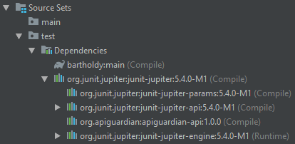
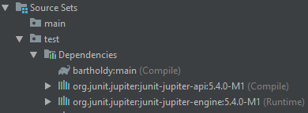

# JUnit Jupiter Aggregator Artifact

Since version `5.4.0-M1` JUnit Jupiter provides an aggregator artifact.
This _empty_ artifact does not contain any class by itself.
It only declares dependencies to _all_ available Jupiter-defining artifacts.

## `junit-jupiter/pom.xml`

Find an excerpt showing the relevant `dependencies` configuration below.
See [org.junit.jupiter/junit-jupiter](https://search.maven.org/artifact/org.junit.jupiter/junit-jupiter) for all details.

For the sake of brevity `<groupId>org.junit.jupiter</groupId>` and `<version>5.4.0-M1</version>` elements are omitted from `pom.xml` snippets below.

```xml
<project>
  <!-- ... -->
  <groupId>org.junit.jupiter</groupId>
  <artifactId>junit-jupiter</artifactId>
  <!-- ... -->
  <dependencies>
    <!-- ... -->
    <dependency>
      <artifactId>junit-jupiter-api</artifactId>
      <scope>compile</scope>
    </dependency>
    <dependency>
      <artifactId>junit-jupiter-params</artifactId>
      <scope>compile</scope>
    </dependency>
    <dependency>
      <artifactId>junit-jupiter-engine</artifactId>
      <scope>runtime</scope>
    </dependency>
  </dependencies>
</project>
```

## Usage with Maven

You may configure the _single_ aggregator artifact `junit-jupiter` in your project like:

```xml
<dependencies>
    <dependency>
        <artifactId>junit-jupiter</artifactId>
        <scope>test</scope>
    </dependency>
</dependencies>
```

instead of specifying each artifact manually: 

```xml
<dependencies>
    <dependency>
        <artifactId>junit-jupiter-api</artifactId>
        <scope>test</scope>
    </dependency>
    <dependency>
        <artifactId>junit-jupiter-params</artifactId>
        <scope>test</scope>
    </dependency>
    <dependency>
        <artifactId>junit-jupiter-engine</artifactId>
        <scope>test</scope> <!-- runtime-only -->
    </dependency>
</dependencies>
```

Note that Maven does not support _runtime-only_ scopes, yet.
Find more details at [Introduction to the Dependency Mechanism](https://maven.apache.org/guides/introduction/introduction-to-dependency-mechanism.html).

## Usage with Gradle 5+

Since Gradle 5, this build tool supports [Separation of compile and runtime dependencies when consuming POMs](https://docs.gradle.org/5.0-rc-5/userguide/upgrading_version_4.html#rel5.0:pom_compile_runtime_separation):

> With this new behavior, the Java and [Java Library](https://docs.gradle.org/5.0/userguide/java_library_plugin.html#sec:java_library_separation) plugins both honor the separation of compile and runtime scopes.
> This means that the compilation classpath only includes compile-scoped dependencies,
> while the runtime classpath adds the runtime-scoped dependencies as well.
> This is particularly useful if you develop and publish Java libraries with Gradle
> where the separation between api and implementation dependencies is reflected in the published scopes.


Use a single `testCompile('org.junit.jupiter:junit-jupiter:VERSION')`:



instead of configuring each api and implementation dependency manually:



to achieve basically the same configuration with less build script code.

Note that both configurations assign `junit-jupiter-engine` to scope `(Runtime)`.
All other transitive dependencies are in scope `(Compile)`.