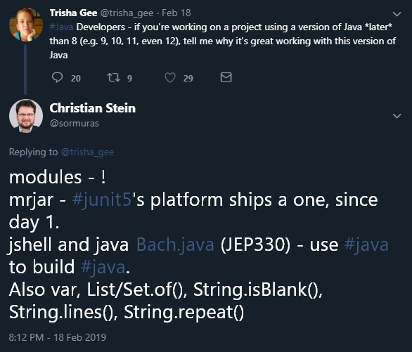

# Life After Java 8 by Trisha Gee

In https://www.youtube.com/watch?v=eot4kLJEnd4 Trisha also talks about _"Why upgrade from Java 8, including language features from Java 9, 10, 11 and 12"_.
I was happy to see her referencing a reply tweet of mine at least four times:

- JShell https://youtu.be/eot4kLJEnd4?t=601
- `var` https://youtu.be/eot4kLJEnd4?t=865
- Multi Release Jar Files https://youtu.be/eot4kLJEnd4?t=1672
- Java Module System https://youtu.be/eot4kLJEnd4?t=1733

Thanks Trisha!

