# Bach.java - Intro 1

Or replay some commands from the [Module System Quick-Start Guide](https://openjdk.java.net/projects/jigsaw/quick-start) in IDEA.

Let `Bach.java` build the project. No configuration required.

## Create Empty Project

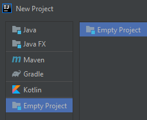

## Set Project Name and Location

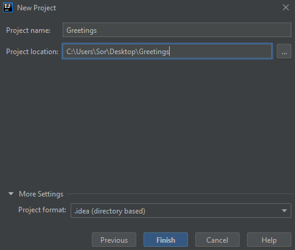

## Create IDEA module named `com.greetings`

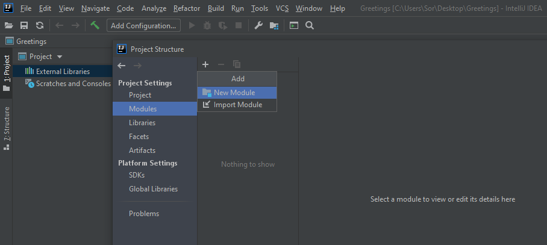

## Set content root and IDEA's module file location

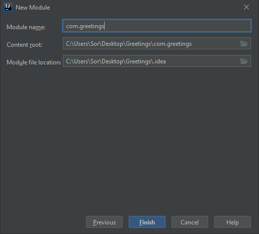

## One IDEA module with a `src` folder

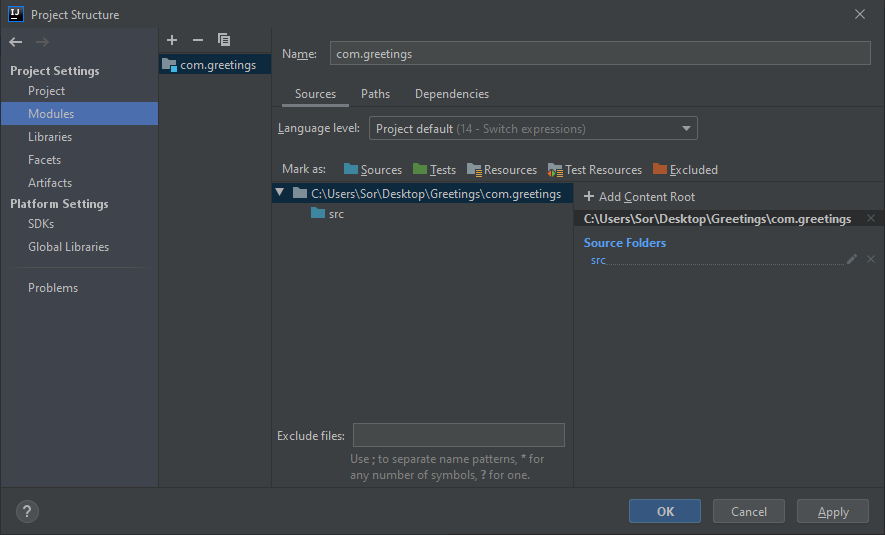

## New `module-info.java` in `src` folder

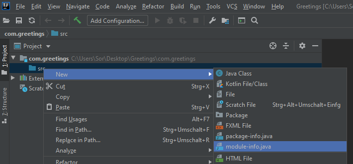

## IDEA generated Java module descriptor for us

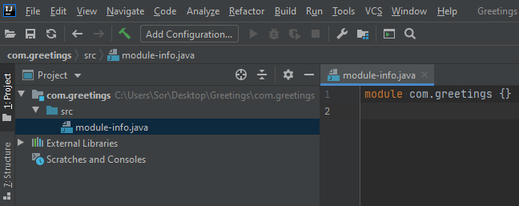

## New Java class in `src` folder

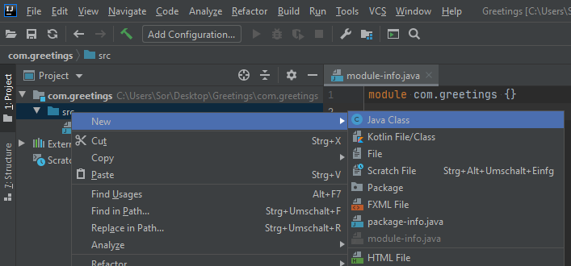

## Enter fully-qualified class name `com.greetings.Main`

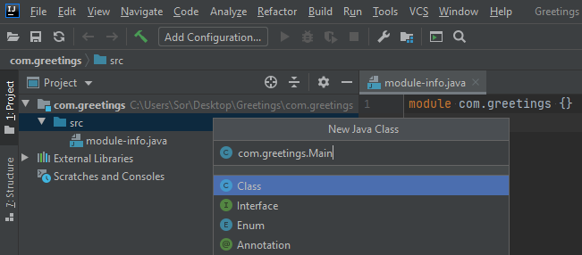

## Implement main method


## Run class `Main.main()` in IDEA

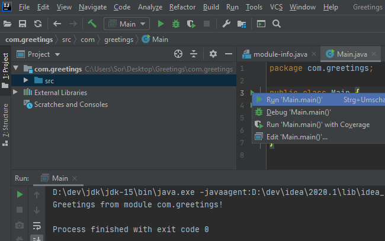

## Open a terminal for `Bach.java`

- Change to the base directory of the project, if necessary.
- Enter `jshell https://sormuras.de/bach-build` (a copy of [bach-build.jsh](https://github.com/sormuras/bach/raw/master/src/bach/bach-build.jsh))
- Wait some seconds to let the zero-installation mode bootstrap `Bach.java` and build the project.

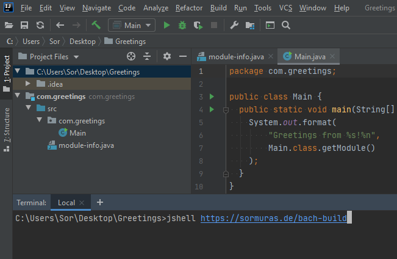

## Run Greetings Image

- Verify with `.bach/workspace/image/bin/greetings` that the program in the image is executable.

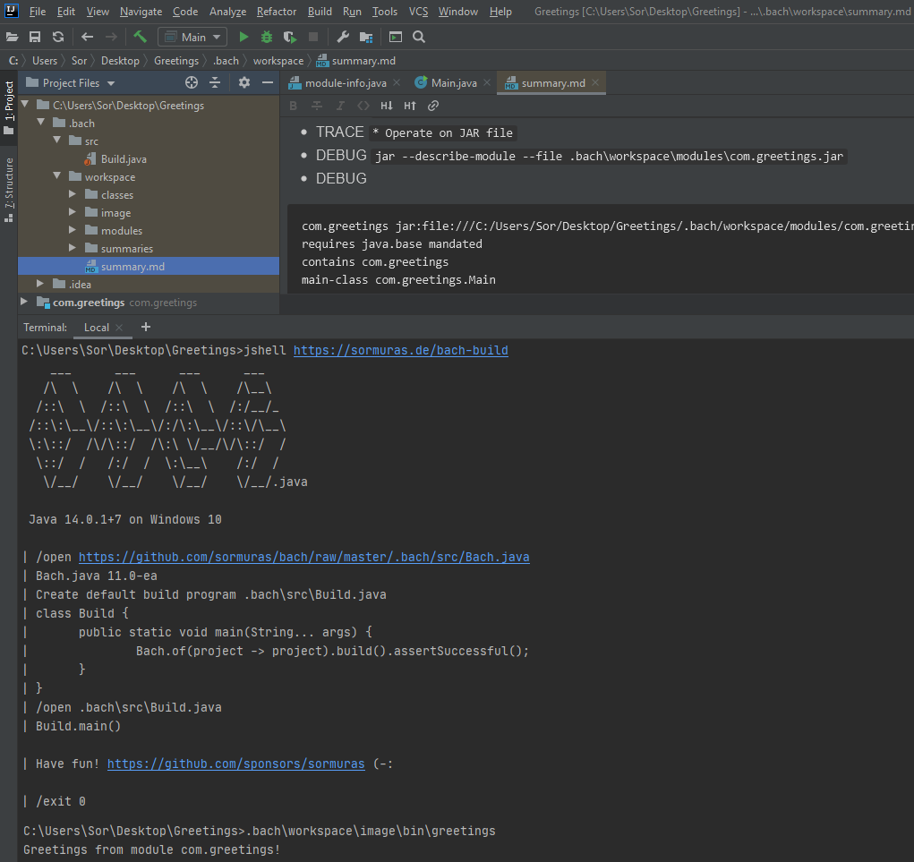

## Want more?

- Browse the `.bach` folder for generated assets.
- A summary of the last build was written the `.bach/summary.md` file.
- Customize the build by editing the `.bach/src/Build.java` program.

```java
class Build {
  public static void main(String[] args){
    Bach.of(project -> project.title("Quick-Start Greetings").version()).build().assertSuccessful();
  }
}
```