# Bach.java - Intro 1 - Greetings!

This blog describes how to let [Bach.java](https://github.com/sormuras/bach) build a modular Java project.

Replay some commands from the [Module System Quick-Start Guide](https://openjdk.java.net/projects/jigsaw/quick-start) in IDEA.

## Prerequisite

- Install [IntelliJ IDEA](https://www.jetbrains.com/idea)
    > Screenshots for this blog post are taken from IDEA 2020.1.1 (Community Edition).
    An older version should be okay, too.

[//]: <> (../asset/img/bach-intro-1/00-AboutIntellijIDEA2020.png)

## New Java Project

- Click **Create New Project** on the Welcome Screen or via the Main Menu **File**/**New**/**Project...**
- Select **Java** in the new project wizard
- Select from **Project SDK** drop-down menu a Java version equal to **11** or higher
    > In this blog JDK 14.0.1 is used.
    >
    > If you haven't already installed a JDK 11+ on your machine,
    make use of IDEA's excellent **Download JDK...** feature offered in drop-down menu.

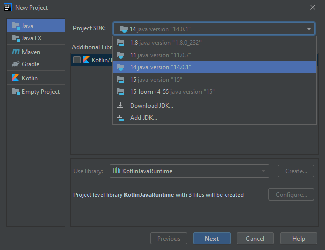

- Click **Next** to finish this step
- Click **Next** to skip **Create project from template** page

## Enter Basic Project Properties

- Enter `Greetings` as the **Project name**
- Choose a location for the project
    > The last path element should read `Greetings`
- Append `/.idea` to the **Module file location** path
    > Keeping all IDEA-related assets in one place, namely below the `.idea/` directory.

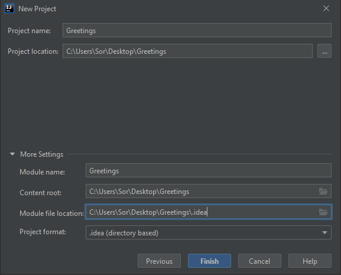

- Click **Finish** to close the new project wizard

    > A popup window may appear - click **OK** to let IDEA create the `Greetings/.idea` directory for you.

## Fine-tune Project Settings

- Open **Project Structure** dialog
- Insert `.idea` element path of **Project compiler output** property
    > Why? To keep all IDEA-related assets in one place, here below the `.idea/out` directory.

- Select `src` folder in **Modules**/**Greetings**/**Sources**
- Press `DEL` key
- Click **Delete**

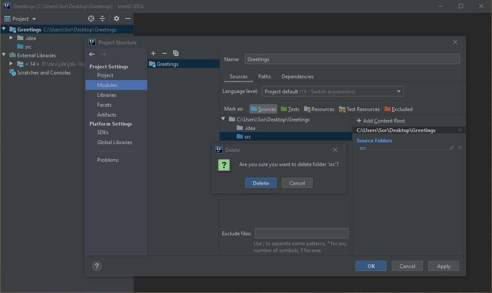

- Click **Unmark Source**

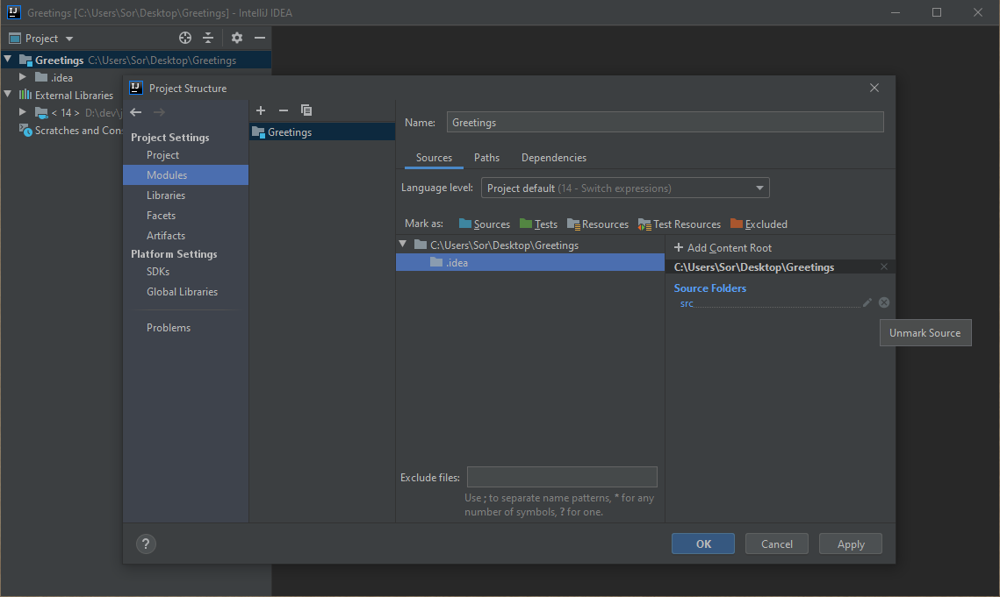

- Click **Apply** to save the fine-tuning.

## Add IDEA Module `com.greetings`

- Click the **+** button at the top of the **Project Settings**/**Modules** page
- Select **New Module**
- Select **Java** -- should be preselected, don't add additional libraries and frameworks

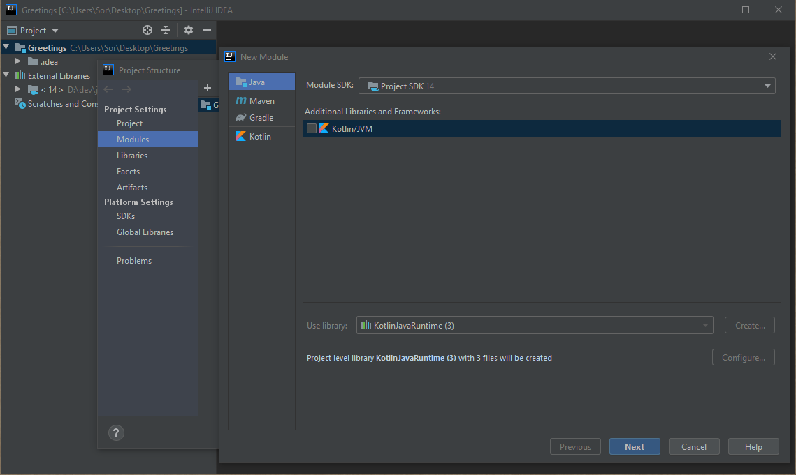

- Click **Next**

- Enter `com.greetings` as **Module name**
- Leave **Content root** as-is
- Replace last element (`com.greetings`) with `.idea` in **Module file location**

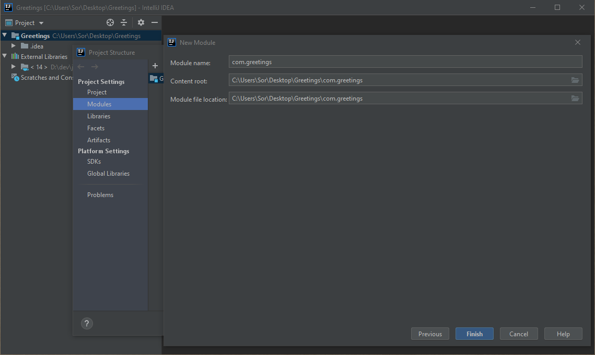

- Click **Finish**
- Repeat deletion of the `src` folder as above and don't forget to unmark it

- Select path `${BASE}/com.greetings` (i.e. **Content Root**) from the Sources overview
- Click/mark as **Sources** as shown below.

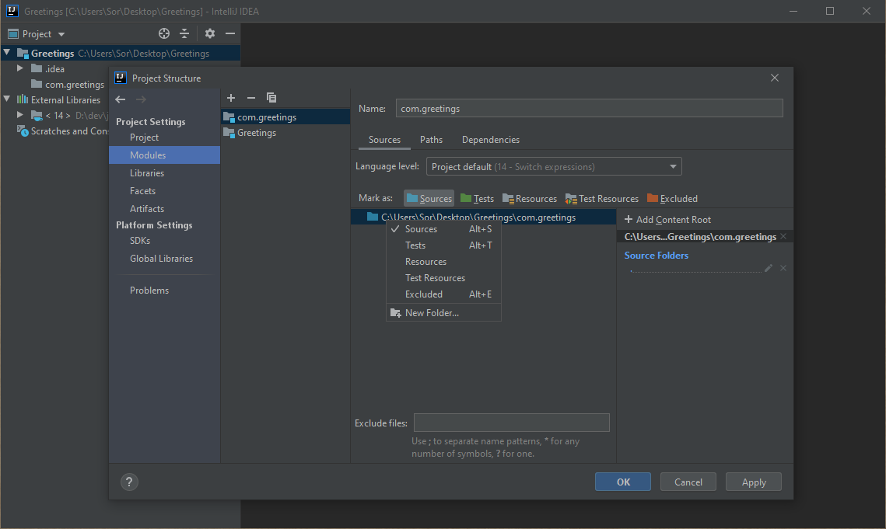

- Click **OK** to close the **Project Structure** dialog

## Add Java Module Descriptor `com.greetings`

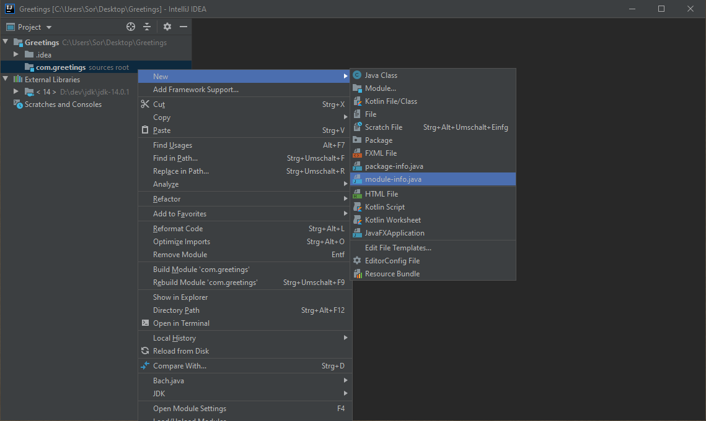

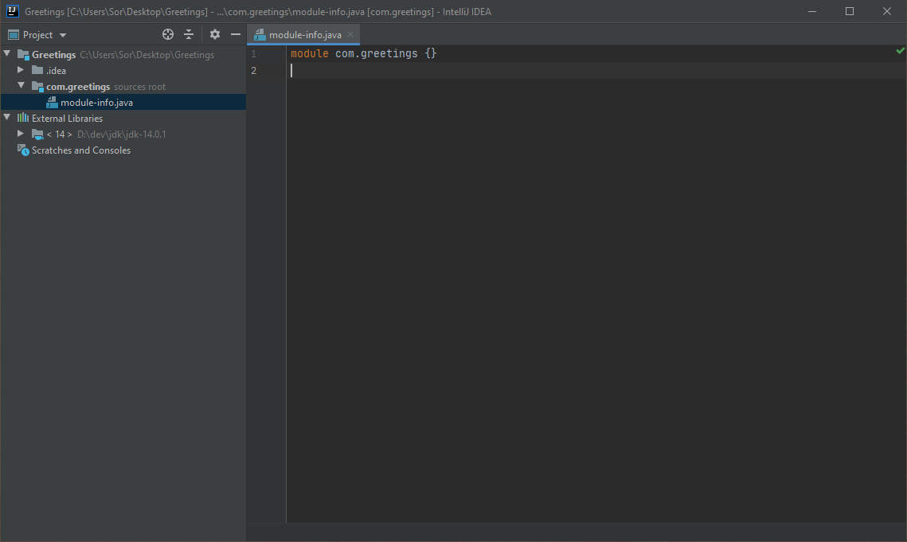

## Add Main Class `com.greetings.Main`

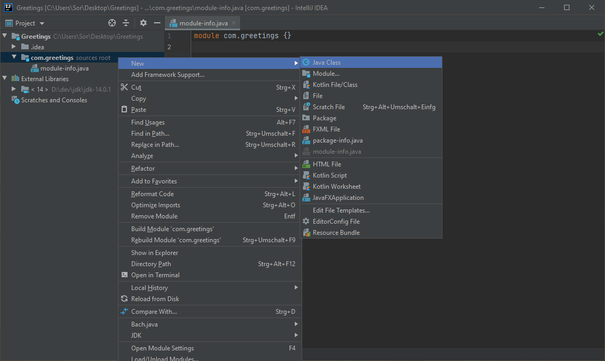

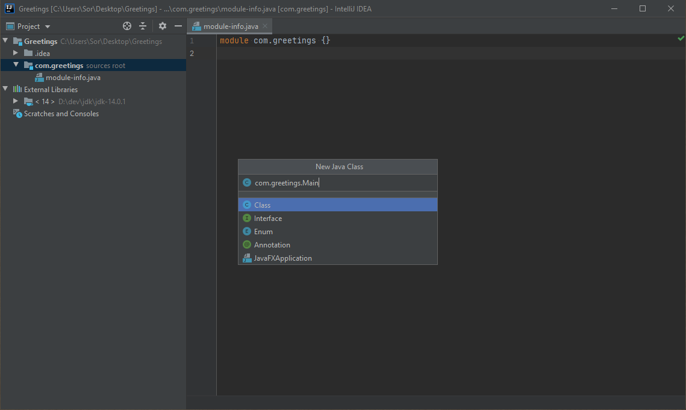

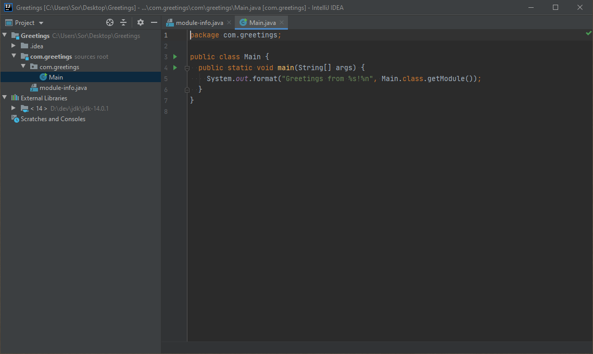

## Run Main Class with IDEA

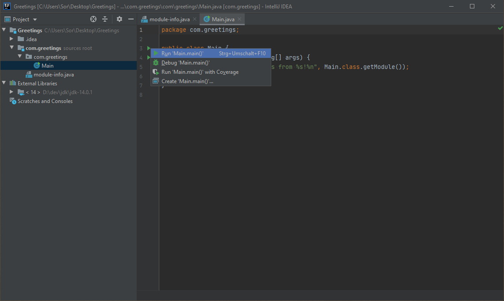

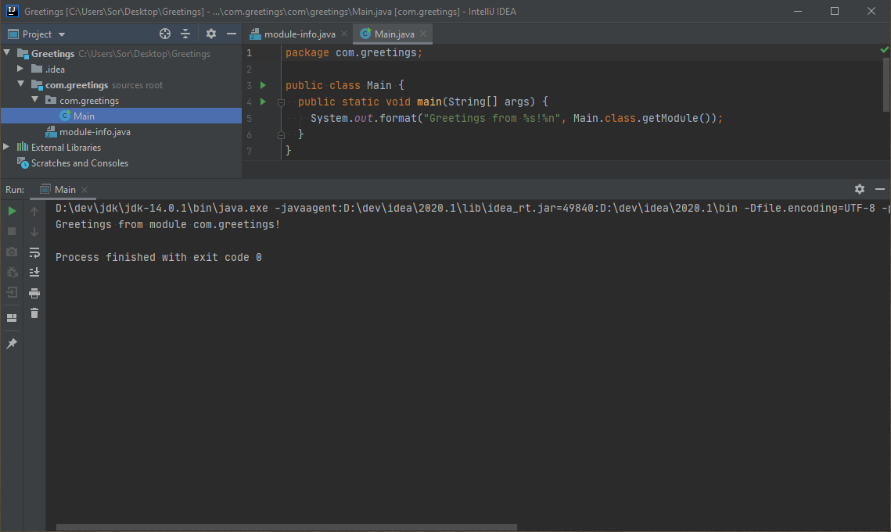

## Build Modular Java Project with Bach.java

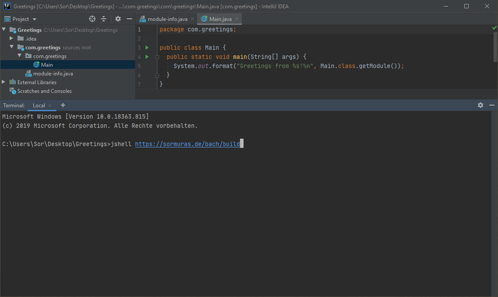

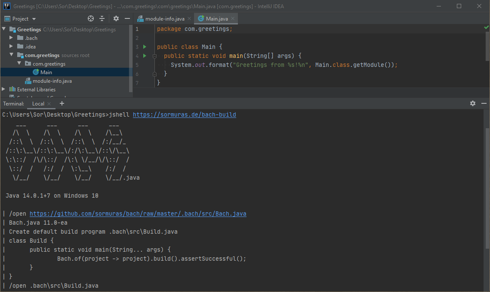

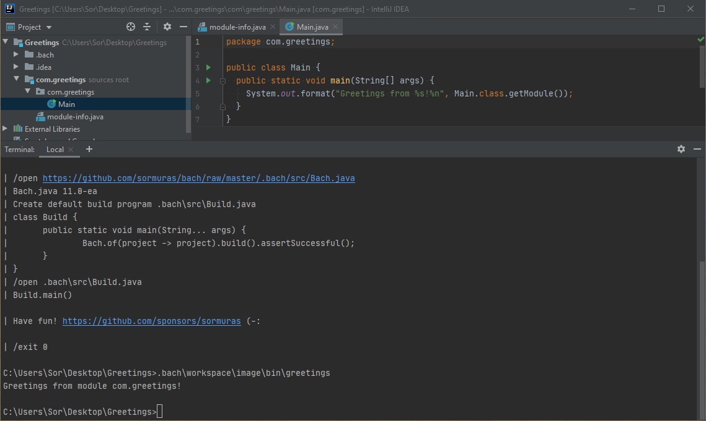

## TL;DR

- Create a modular Java project.
- Invoke `jshell https://sormuras.de/bach-build`
- Run and Have Fun!
