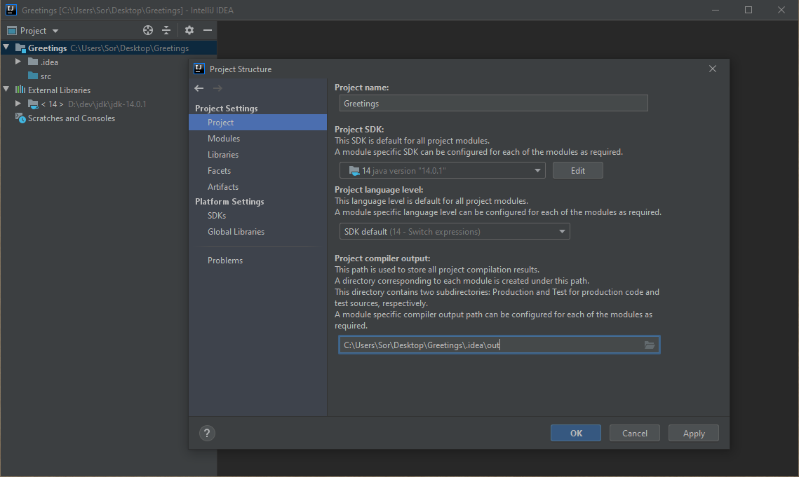
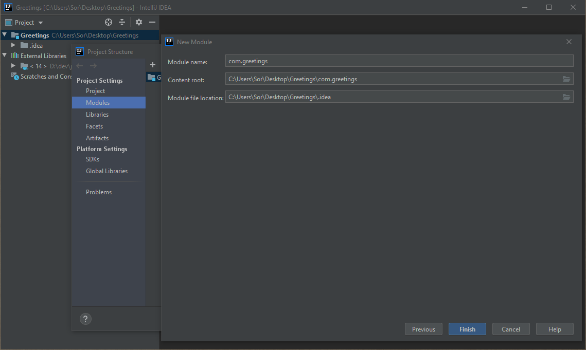

# 🎼 Bach.java - Intro 1 - Greetings!

Welcome to a series of blog posts describing how [Bach.java](https://github.com/sormuras/bach) builds a modular Java project.

This initial introduction prepares the foundation for more blog posts to come.
The felt ratio of 99% IDEA-related sections to only 1% relevant for Bach.java is on purpose.
Later posts will build upon this one and only refer to IDEA-related instructions covered here.

> **TL;DR**
>
> - Create a modular Java project or clone/download [bach-intro-1-greetings](https://github.com/sormuras/bach-intro-1-greetings) from GitHub
> - Run `jshell https://sormuras.de/bach/build`
> - Done
>
> Fast-forward to the [Build Modular Java Project with Bach.java](#build-modular-java-project-with-bachjava) section.

The remainder and the majority of the text sections below is about setting up IntelliJ IDEA for a modular Java project.
In order to not re-invent wheels this blog borrows ideas and replays commands from the [Module System Quick-Start Guide](https://openjdk.java.net/projects/jigsaw/quick-start).
It doesn't hurt to (re-)visit that guide before reading on.

Without further a do, let's start hacking ... erm, clicking!

## Prerequisite

- Install [IntelliJ IDEA](https://www.jetbrains.com/idea)
    > Screenshots for this blog post are taken from IDEA 2020.1.1 (Community Edition).
    An older version should be okay, too.

[//]: <> (../asset/img/bach-intro-1/00-AboutIntellijIDEA2020.png)

## New Java Project

- Click **Create New Project** on the Welcome Screen or via the Main Menu **File**/**New**/**Project...**
- Select **Java** in the new project wizard
- Select from **Project SDK** drop-down menu a Java version equal to **11** or higher
    > In this blog JDK 14.0.1 is used.
    >
    > If you haven't already installed a JDK 11+ on your machine,
    make use of IDEA's excellent **Download JDK...** feature offered in the drop-down menu shown below.

- Click **Next** to finish this step
- Click **Next** to skip **Create project from template** page

## Enter Basic Project Properties

- Enter `Greetings` as the **Project name**
- Choose a location for the project
    > The last path element should read `Greetings`
- Append `/.idea` to the **Module file location** path in the **More Settings** group
    > Keeping all IDEA-related assets in one place, namely below the `.idea/` directory.

- Click **Finish** to close the new project wizard

    > A popup window may appear - click **OK** to let IDEA create the `Greetings/.idea` directory for you.

## Fine-tune Project Settings

IDEA created an initial project structure.
Some settings require a fine-tune pass.

IDEA has its own idea of storing all Java sources of an IDEA module in a nested `src/` directory.
In the following, we'll delete and unmark such a `src/` directory twice.
Once per created IDEA module.
Without the `src/` directories the structure matches the example from the Quick-Start Guide better.

- Open **Project Structure** dialog
- Insert `.idea` element in the existing path of **Project compiler output** property as shown below
    > Why? To keep all IDEA-related assets in one place, here below the `.idea/out` directory.

- Select `src` folder in **Modules**/**Greetings**/**Sources**
- Press `DEL` key
- Click **Delete**

- Click **Unmark Source** as shown below

- Click **Apply** to save the fine-tuning.

## Add IDEA Module `com.greetings`

Let's create an IDEA module named `com.greetings`.
It will host the Java module with the same name.

Yes, as mentioned above, the hereby automatically created `src/` directory will be deleted.

- Click the **+** button at the top of the **Project Settings**/**Modules** page
- Select **New Module**
- Select **Java** -- should be preselected, don't add additional libraries and frameworks

- Click **Next**

- Enter `com.greetings` as **Module name**
- Leave **Content root** as-is
- Replace last element (`com.greetings`) with `.idea` in **Module file location**

- Click **Finish**
- Repeat deletion of the `src` folder as above and don't forget to unmark it

Every IDEA module that hosts Java source files mandates at least a single **Sources Folder** to be selected.
Here, the content root directory of the just created IDEA module is marked as such.

- Select path `${BASE}/com.greetings` (i.e. **Content Root**) from the Sources overview
- Click/mark as **Sources** as shown below.

- Click **OK** to close the **Project Structure** dialog

## Add Java Module Descriptor `com.greetings`

With IDEA's project structure set up and fine-tuned, let's add Java source files.
The Quick-Start Guide Greetings example reads:

> The module consists of two source files: the module declaration (`module-info.java`) and the main class.

- Right-click on the `com.greetings` IDEA module
- Select **New** ▶ **module-info.java**

IDEA just generated an empty, yet proper Java [Module Declaration](https://docs.oracle.com/javase/specs/jls/se11/html/jls-7.html#jls-7.7) for us!

## Add Main Class `com.greetings.Main`

After declaring the Java module `com.greetings`, now it's the turn of the main program.

- Right-click on the `com.greetings` IDEA module, again
- Select **New** ▶ **Java Class**

- Enter the fully qualified class name: `com.greetings.Main`

IDEA just generated an empty `Main.java` file and stored in package `com.greetings`.

- Add a main method that prints a greeting to the normal output stream

That's it.
All is set up for running the program.

## Run Main Class with IDEA

- Click on one of the Play icons next to the editor frame
- Select ▶ **Run 'Main.main()'**
    > _Press Play On Tape_ ...

- Verify that the greeting message is printed and the process finished with exit code 0

## Build Modular Java Project with Bach.java

Finally...

- Open a **Terminal** session
    > Change to the base directory of the project, if necessary.
- Type `jshell https://sormuras.de/bach/build` and press **Enter**
    > This URL redirects to the [bach-build.jsh](https://github.com/sormuras/bach/raw/master/src/bach/bach-build.jsh) script.
    That JShell-based script forms the zero-installation feature of Bach.java.
    >
    > Run `jshell -R-Debug https://sormuras.de/bach/build` to see what Bach.java is doing.

Wait some seconds to let the zero-installation feature bootstrap `Bach.java` and build the project.

- Verify with `.bach/workspace/image/bin/greetings` that the main program is executable
    > of the Greetings project in the generated custom runtime image 

Done.

## Want more?

> Here's a short video showing Bach 11.8 in action: [https://youtu.be/LyJ9BfZfEsI](https://youtu.be/LyJ9BfZfEsI)

- Browse the `.bach` folder for generated assets: classes, modules, image, summaries, ...
- A summary of the last build is written to the `.bach/summary.md` file.
- Attach some `/** Javadoc */` comment to `module com.greetings {}` and run `bach-build.jsh` again.
- Customize the build by editing the `.bach/src/Build.java` program.
