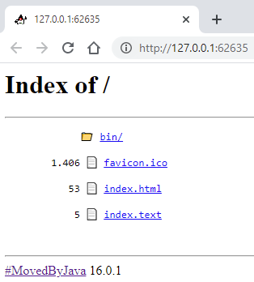

# In-memory HttpServer Handler

Inspired by JEP's 408 summary, which reads:

> **Summary**
> Provide a command-line tool to start a minimal web server that serves static files in the current directory.
> This low-threshold utility will be useful for prototyping, ad-hoc coding, and testing purposes, particularly in educational contexts.

Here's a http handler implementation that servers in-memory assets.
This is useful for running http client tests that want to issue GET or HEAD requests against a well-known set of assets. 

## Asset

An asset record encapsulates a http return code, the bytes to send, and a type component that is used as
the `Content-Type` response header.

```java
public record Asset(int code, byte[] data, String type) {

  public static Asset of(byte... bytes) {
    return new Asset(200, bytes, "application/octet-stream");
  }

  public static Asset ofBase64(String base64, String type) {
    return new Asset(200, Base64.getDecoder().decode(base64), type);
  }

  public static Asset ofHtml(String html) {
    return Asset.ofText(200, html, "text/html");
  }
  
  public static Asset ofText(String text) {
    return Asset.ofText(200, text, "text/plain");
  }

  public static Asset ofText(int code, String text, String type) {
    return new Asset(code, text.getBytes(StandardCharsets.UTF_8), type);
  }

  // ... here be more convenient factory methods
}
```

All well-known assets are organized in a `Map<String, Asset>`, with absolute request paths used as keys. 

```java
Map<String, Asset> createAssets() {

    return Map.of(
        "/index.text", Asset.ofText("Index"),

        "/index.html", Asset.ofHtml(
        """
        <html>
          <body>
            <h1>Index</h1>
          </body>
        </html>
        """)
    
        // ... here be more path-asset mappings
    );
}
```

By default, all paths representing a directory (end with `/`) are mapped to an asset that generates a directory listing.
All other unmapped paths (non-directory) are mapped to an asset that renders a 404 error page.

## Command-line Demo

Launch an in-memory http server demo on the command-line via: `java InMemoryHttpServer.java`

```text
InMemoryHttpServer
http://127.0.0.1:62635
```

Open the URL in a browser:



## Links

- [InMemoryHttpServer.java](../demo/main/InMemoryHttpServer.java)
- [Module `jdk.httpserver`](https://docs.oracle.com/en/java/javase/16/docs/api/jdk.httpserver/module-summary.html)
- [JEP 408: Simple Web Server](https://openjdk.java.net/jeps/408)
